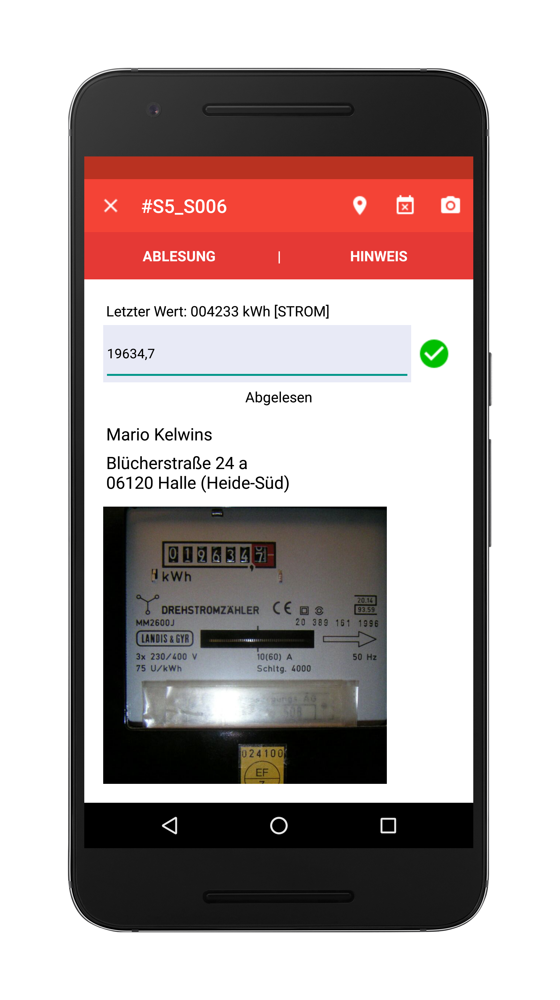
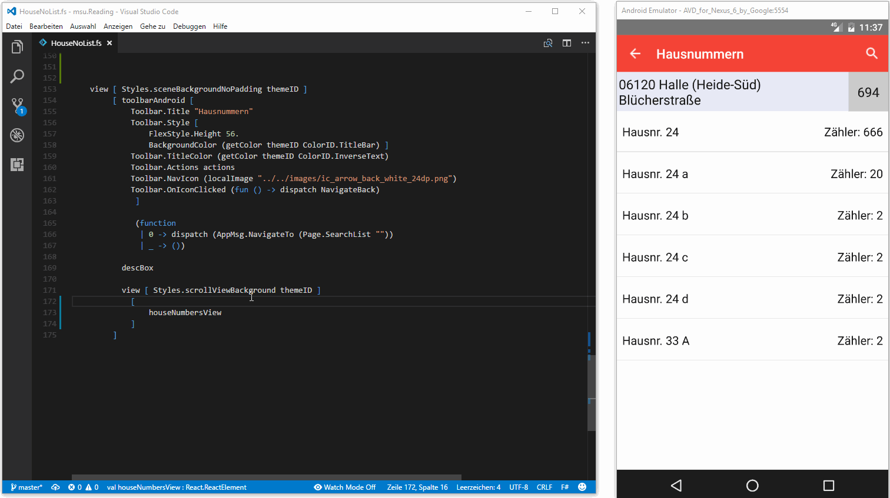
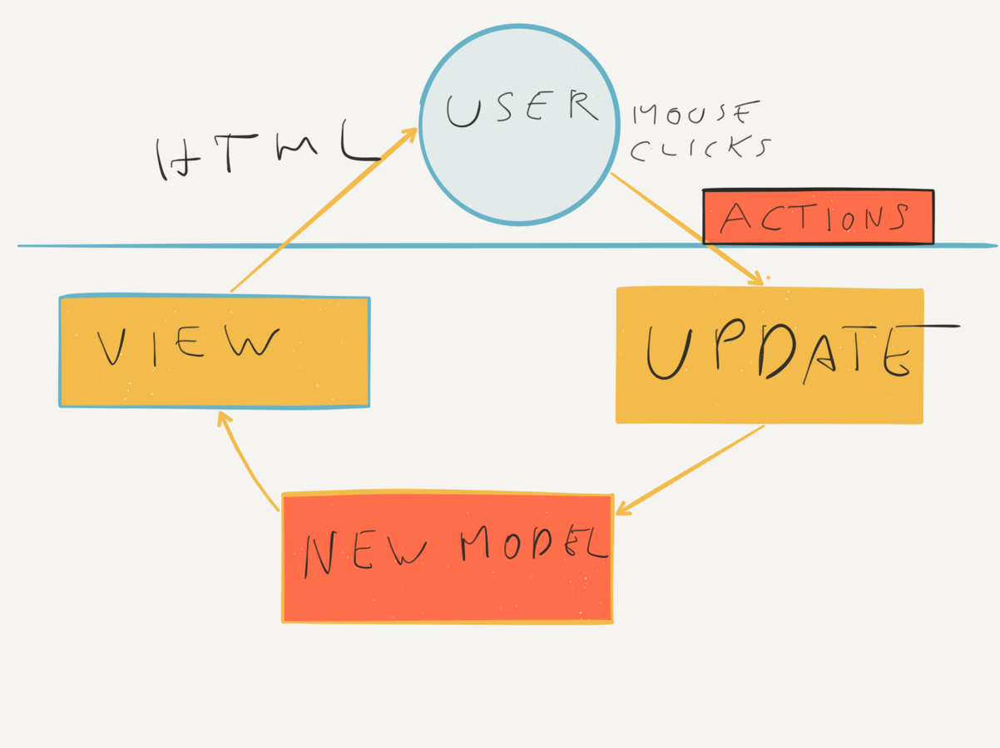
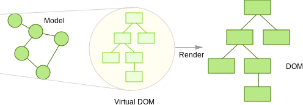
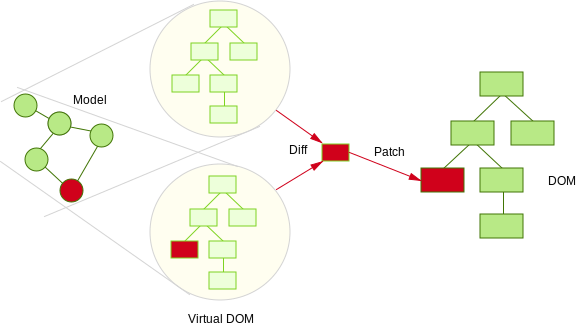
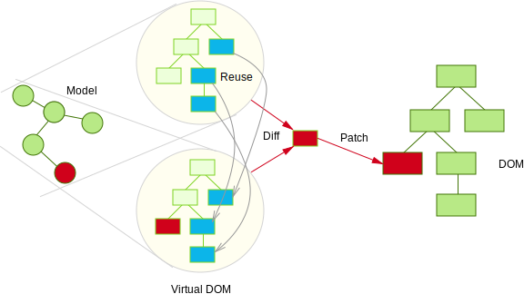
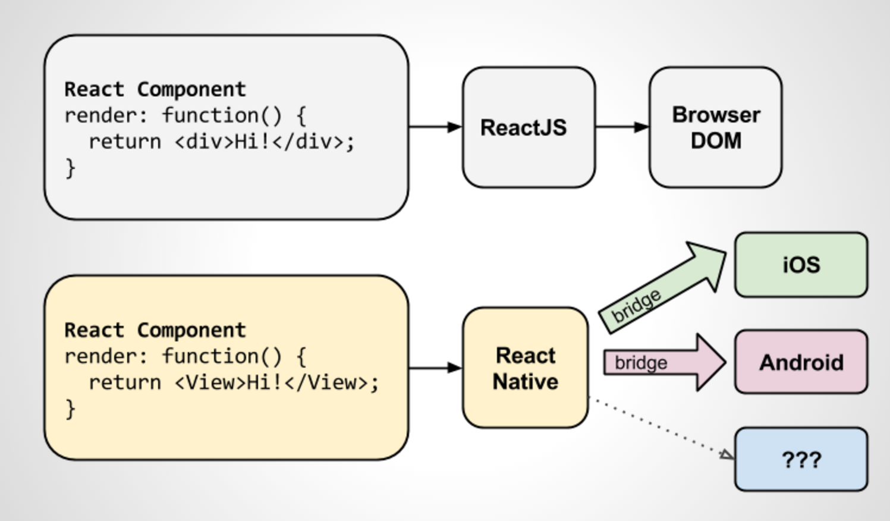

- title : React Native with F#
- description : Introduction to React Native with F#
- author : Steffen Forkmann
- theme : night
- transition : default

***

## React Native with F#

 
 

### Modern mobile app development

 
 
Steffen Forkmann - [@sforkmann](http://www.twitter.com/sforkmann)

***

### Modern mobile app development?

* UI/UX
    * "Native mobile apps"
    * Performance
* Tooling
    * Hot loading
    * IntelliSense
* Maintainability
    * Easy to debug
    * Correctness

---

### "Native" UI

 

---

### Tooling

*** 

### Model - View - Update

#### "Elm - Architecture"

 

 <small>http://danielbachler.de/2016/02/11/berlinjs-talk-about-elm.html</small>

--- 

### Model - View - Update

    // MODEL

    type Model = int

    type Msg =
    | Increment
    | Decrement

    let init() : Model = 0

---

### Model - View - Update

    // VIEW

    let view model dispatch =
        div []
            [ button [ OnClick (fun _ -> dispatch Decrement) ] [ str "-" ]
              div [] [ str (model.ToString()) ]
              button [ OnClick (fun _ -> dispatch Increment) ] [ str "+" ] ]

---

### Model - View - Update

    // UPDATE

    let update (msg:Msg) (model:Model) =
        match msg with
        | Increment -> model + 1
        | Decrement -> model - 1

---

### Model - View - Update

    // wiring things up

    Program.mkSimple init update view
    |> Program.withConsoleTrace
    |> Program.withReact "elmish-app"
    |> Program.run

---

### Model - View - Update

# Demo

***

### Sub-Components

    // MODEL

    type Model = {
        Counters : Counter.Model list
    }

    type Msg = 
    | Insert
    | Remove
    | Modify of int * Counter.Msg

    let init() : Model =
        { Counters = [] }

---

### Sub-Components

    // VIEW

    let view model dispatch =
        let counterDispatch i msg = dispatch (Modify (i, msg))

        let counters =
            model.Counters
            |> List.mapi (fun i c -> Counter.view c (counterDispatch i)) 
        
        div [] [ 
            yield button [ OnClick (fun _ -> dispatch Remove) ] [  str "Remove" ]
            yield button [ OnClick (fun _ -> dispatch Insert) ] [ str "Add" ] 
            yield! counters ]

---

### Sub-Components

    // UPDATE

    let update (msg:Msg) (model:Model) =
        match msg with
        | Insert ->
            { Counters = Counter.init() :: model.Counters }
        | Remove ->
            { Counters = 
                match model.Counters with
                | [] -> []
                | x :: rest -> rest }
        | Modify (id, counterMsg) ->
            { Counters =
                model.Counters
                |> List.mapi (fun i counterModel -> 
                    if i = id then
                        Counter.update counterMsg counterModel
                    else
                        counterModel) }

---

### Sub-Components

# Demo

***

### React

* Facebook library for UI 
* <code>state => view</code>
* Virtual DOM

---

### Virtual DOM - Initial

 
 

 

 
 

 <small>http://teropa.info/blog/2015/03/02/change-and-its-detection-in-javascript-frameworks.html</small>

---

### Virtual DOM - Change

 
 

 

 
 

 <small>http://teropa.info/blog/2015/03/02/change-and-its-detection-in-javascript-frameworks.html</small>

---

### Virtual DOM - Reuse

 
 

 

 
 

 <small>http://teropa.info/blog/2015/03/02/change-and-its-detection-in-javascript-frameworks.html</small>

*** 

### ReactNative

 

 <small>http://timbuckley.github.io/react-native-presentation</small>

***

### Show me the code

*** 

### TakeAways

* Learn all the FP you can!
* Simple modular design

*** 

### Thank you!

* https://github.com/fable-compiler/fable-elmish
* https://ionide.io
* https://facebook.github.io/react-native/
