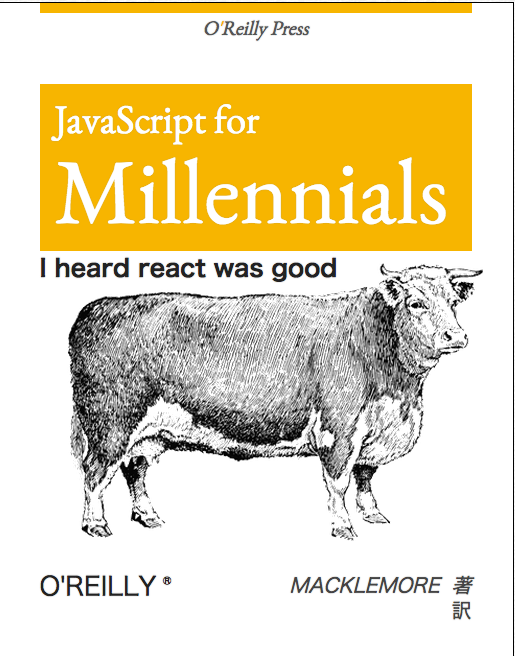

- title : React Native with F#
- description : Introduction to React Native with F#
- author : Steffen Forkmann
- theme : night
- transition : default

***

## React Native with F#

### Look mum no JavaScript

 
 
Steffen Forkmann

[@sforkmann](http://www.twitter.com/sforkmann)

***

---

### React

* Facebook library for UI 
* <code>(state) => view</code>
* Virtual DOM to calc minimal number of DOM changes necessary

---

### Virtual DOM - Inital

 
 

 

 
 

 <small>http://teropa.info/blog/2015/03/02/change-and-its-detection-in-javascript-frameworks.html</small>

---

### Virtual DOM - Change

 
 

 

 
 

 <small>http://teropa.info/blog/2015/03/02/change-and-its-detection-in-javascript-frameworks.html</small>

---

### Virtual DOM - Reuse

 
 

 

 
 

 <small>http://teropa.info/blog/2015/03/02/change-and-its-detection-in-javascript-frameworks.html</small>

*** 

### ReactNative

 

 <small>http://timbuckley.github.io/react-native-presentation</small>

*** 

### Elm - Architecture

 

 <small>http://danielbachler.de/2016/02/11/berlinjs-talk-about-elm.html</small>

---

### Elm - Architecture -Benefits

* Model is single source of truth
* A pure view function
* Side effects are modelled as Tasks, handled by the runtime
* Apps are well structured. All state modifications happen in the central update

*** 

### Show me the code
